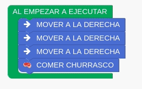
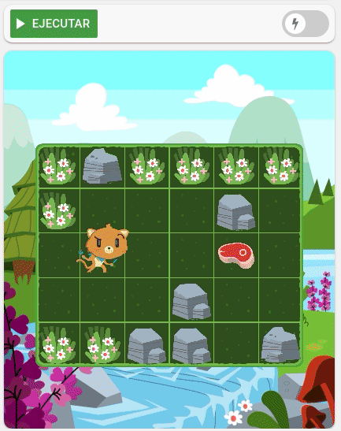
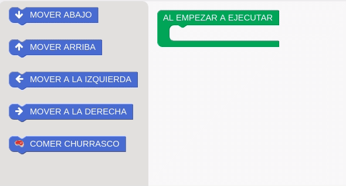
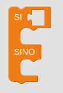
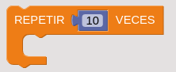
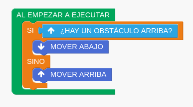

# Placa 1 - Introducción
Hoy en coopademia especial niñes!: Programación en bloques con Pilas Bloques.

# Placa 2 - Qué es la programación en bloques?

La programación en bloques es una manera de desarrollar programas con instrucciones y acciones en forma de bloques.

Al encastrar los bloques entre sí, estaríamos armando el programa que resuelve el problema o desafío.

# Placa 3 - Por qué es ideal para aprender?

Todos los conceptos abstractos de programación tienen su representación visual.

Es decir, no es necesario escribir código! y no tendremos esa frustración cuando cometemos errores de sintaxis.

Armar los programas es tan simple como seleccionar los bloques, arrastrarlos, y encastrarlos!

# Placa 4 - Aprendé con Pilas Bloques

Pilas Bloques es una aplicación Argentina para aprender a programar de una forma interactiva y autodidacta.

Está llena de desafíos con varios niveles, para acercar a les niñes al mundo de la programación.

A medida que avanzamos en los desafíos iremos aprendiendo diferentes conceptos y estructuras, tales como:

- Condiciones:

- Estructuras de condición:

- Estructuras de repetición:

Y la interacción entre las instrucciones, condiciones y estructuras es completamente intuitiva:

Pilas Bloques está dividido en dos ciclos:
- Primer ciclo: orientados para edades de 5 a 8 años
- Segundo ciclo: orientados para edades de 9 a 12 años

La aplicación está disponible para Linux, Windows, Mac OS X y también versión web.
Todas disponibles en su sitio:
pilasbloques.program.ar

# Placa 5

Próximamente más programación para niñes!

# Links

https://pilasbloques.program.ar/
