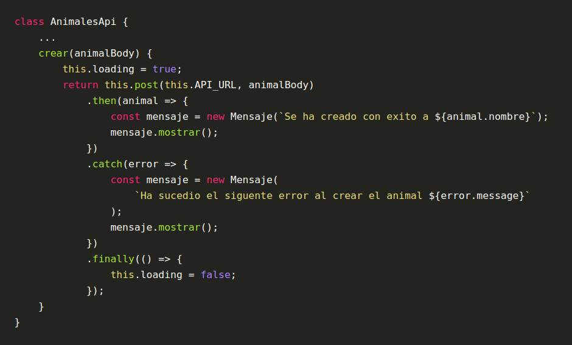
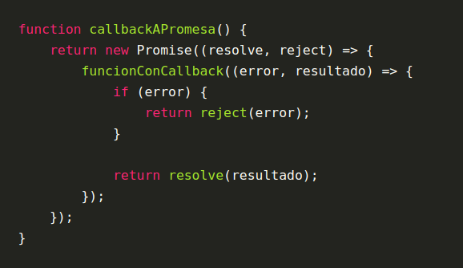

# Placa 1 ¿Qué son las promesas?

Una promesa es un objeto que representa la terminación o el fracaso de una operación asíncrona. El objeto promesa expone el método *then* (luego veremos otros) que nos permite adjuntar funciones de retornos (que llamaremos callbacks) para ejecutar en el caso de éxito o fracaso de la operación asíncrona.

Una promesa siempre cumple con las siguientes garantías:

* Las funciones callback nunca serán llamadas antes de la terminación de la ejecución actual del bucle de eventos de JavaScript.
* Las funciones callback añadidas con then() incluso después del éxito o fracaso de la operación asíncrona serán llamadas.
* Múltiples funciones callback pueden ser añadidas llamando a then() varias veces. Cada una de ellas es ejecutada una seguida de la otra, en el orden en el que fueron insertadas.

# Placa 2 Operaciones con promesas en JavaScript

* .then(*exitoCallback*, *falloCallback*): Ejecutará *exitoCallback* si la operación se completó satisfactoriamente y ejecutará *falloCallback* si la operación falló.
*exitoCallback* recibe el resultado de la promesa y *falloCallback* recibe el error que ocasionó el fallo. Retorna una promesa que contendrá el resultado de la función ejecutada.
* .catch(*callback*): Ejecutará *callback* solamente si la operación falló y retona una promesa que contendrá el resultado de la función ejecutada. *callback* recibe el error que ocasionó el fallo. Es lo mismo que llamar .then(null, *callback*). En el caso de que la operación se complete satisfactoriamente retornar la promesa original.
* finally(*callback*): Ejecutará *callback* independientemente del estado de la promesa. *callback* no recibe parametros. Retorna la promesa original salvo que haya sucedido un error dentro de *callback*, entoncés retornara una promesa en estado de fallo con el error. 

# Placa 3 Ejemplo

Pensemos que tenemos que hacer un método que realice una request post (usando una función auxiliar que retorna una promesa) a una api de animales para crear un registro nuevo. Si la creación es exitosa queremos mostrar un mensaje de éxito y lo mismo para el caso de fallo. Además tenemos que setear el atributo loading del objeto en true mientras se lleve a cabo la operación.

# Placa 4 Convertir una función que utiliza callback a una que retorna una promesa

También podemos convertir una funcíon que utiliza un callback a una función que retorna una promesa usando el constructor *Promise*. Este constructor recibe una función como parametro que recibe dos funciones como parametro: *resolve* y *reject*. Al llamar a *resolve* indicamos que la operación asíncrona fue exitosa y al llamar *reject* indicamos que la misma falló.

# Placa 5

Próximamente más tips de operaciones asincrónicas

# Links

- https://developer.mozilla.org/es/docs/Web/JavaScript/Guide/Using_promises