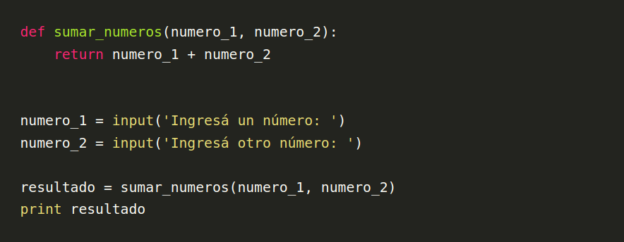
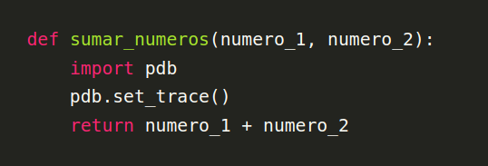

# Placa 1 ¿Qué es un debugger?

Es una herramienta que te permite frenar la ejecución de un programa y evaluar el estado del mismo (de sus variables) en el punto en que se frenó.
Esto se vuelve superutil cuando tenemos errores o comportamientos extraños en nuestro código pero no podemos saber por qué.

En general antes de conocer los debuggers hacemos uso de herramientas que imprimen por consola las variables que queremos evaluar. Y si bien es una estrategia que puede tener su utilidad, los debuggers añaden muchas otras.

En este caso vamos a mostrarte como ejemplo la herramientas de debugging que trae Python, pdb (Python Debugger).

# Placa 2 Ejemplo

Supongamos que nuestro programa es el siguiente:




Ejecutamos el programa, y cuando nos piden cada número ingresamos primero un 3, y luego un 4.
Cuando vemos el resultado descubrimos que en vez de un valor de 7 obtuvimos un 34. 
Vamos a usar este sencillo ejemplo para mostrar la utilidad de pdb.


# Placa 3 Como debuggear nuestro código

Vamos a agregar al código un breakpoint, es decir, una instrucción del debugger para que frene en el momento en que queremos evaluar nuestro código.


* Primero tenemos que importar el módulo:
```import pdb```.
* Luego usamos la función **set_trace()** para indicarle que frene exactamente en ese punto:
 ```pdb.set_trace()```. No sólo el código frena, sino que nos permite interactuar dentro del mismo, podemos ingresar cualquier instrucción de Python

Por ejemplo, vamos a generar ese breakpoint en la función que suma, que es adonde suponemos está nuestro error:



# Placa 4 Continuación

Al ejecutar nuestro código vamos a ver:
```
> python3 prueba1.py
Ingresá un número: 3
Ingresá otro número: 4
> /home/devecoop/coopadiemia/debugging/aprendiendo_pdb.py(4)sumar_numeros()
-> return numero_1 + numero_2
(Pdb)
```

1. Lo primero que vemos es que la herramienta nos marca el punto exacto en el que está parado nuestra ejecución:
La ruta absoluta del archivo, el número de línea entre paréntesis y luego el nombre de la función.
2. Lo siguiente que nos muestra es la próxima línea que se ejecutará luego de que le digamos al debugger que continúe (o sea, esa línea aún no fue ejecutada, si fuera la creación de una variable no podríamos en este punto acceder a ella).
3. El prompt **(Pdb)** nos señala que nuestro código está frenado con el debugger, y en ese prompt podemos usar cualquier instrucción de Python, y tenemos acceso a todas las variables que son accesibles en ese contexto (scope).

# Placa 5 Continuación

Entonces por ejemplo podemos ver el contenido de los parámetros de la función en la que está frenado el código. No es necesario usar print, ya que por defecto pdb va a imprimir las variables o los resultados de ejecuciones que le pidamos:

```python
(Pdb) numero_1
'3'
(Pdb)
```

Pdb nos devuelve el valor y ya podemos intuir nuestro problema, el número 3 es en realidad un string, lo vemos con las comillas. Pero si queremos asegurarnos todavía más podemos evaluar el tipo de esa variable:

```python
(Pdb) type(numero_1)
<class 'str'>
(Pdb)
```

Con esto ya podemos suponer que el problema es que estamos concatenando strings y no sumando números.

# Placa 6 Comandos para moverse dentro del debugger
Una vez que está frenado el código en un breakpoint los comandos más básicos son:

* **n**: ejecuta la línea actual y se mueve a la siguiente línea de la función en la que está frenado nuestro código.

* **c:** continuar la ejecución hasta el próximo breakpoint (si existe) o hasta finalizar el programa.

* **l**: imprime en pantalla las 10 líneas de código anteriores a la línea actual, la línea actual y las 10 líneas posterioress a la actual.

* **q**: sale del debugger.

# Placa 7 TIP final

**No olvides sacar los breakpoints de tu código antes de commitear!**
