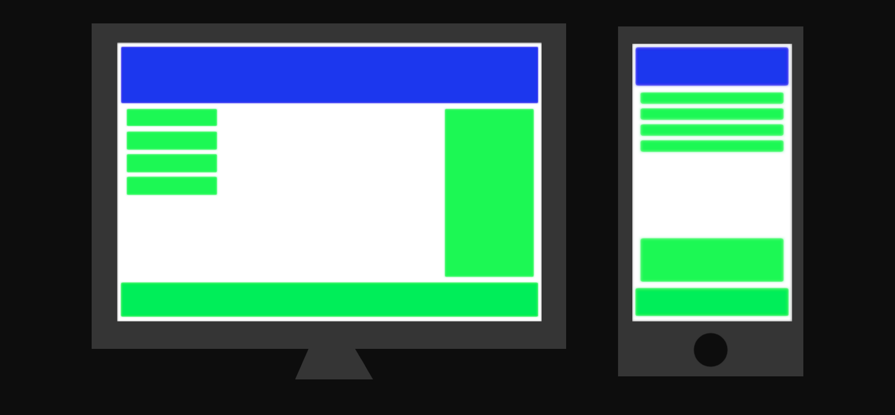
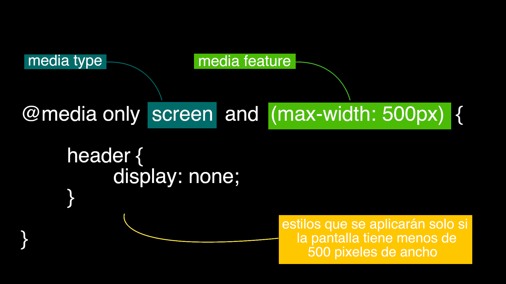
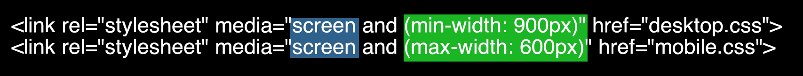

# Placa 1 - Introducción
Hoy en coopademia: Screen media queries en CSS

# Placa 2 - Qué son las media queries?

Las media queries son un metodo de CSS que nos permite aplicar diferentes estilos basandose en características del
dispositivo (tamaño de pantalla, orientación, entre otras).

Utilizando la regla **@media**, podemos incluír un bloque de propiedades de CSS si las condiciones dadas son verdaderas.

En el desarrollo de sitios responsive, las usamos para adaptar el contenido a diferentes tamaño de pantalla.

# Placa 3 - Cómo están compuestas las media queries?

Las media queries consisten de una o más **mediatypes** y **mediafeatures**.
Los **mediatype** son los tipos de medio en el que se aplicará la query. Estos pueden ser:
- `all`: Para todos los dispositivos.
- `print`: Para las impresiones (pueden verse en la vista previa de la impresión)
- `screen`: Para las pantallas del dispositivo.
- `speech`: Para sintetizadores de voz.

Y las **mediafeatures** son una o mas expresiones que indicarán sobre qué características se aplicará la query.
En este caso, veremos las **mediafeatures** más comunes para el `screen` mediatype, que indican distintas propiedades de la pantalla.

Entre ellas puede encontrarse:
- `height`: Alto de la pantalla
- `width`: Ancho de la pantalla
- `orientation`: Orientación de la pantalla (si el celular está horizontal)
- `resolution`: Resolución de la pantalla

Si queremos aplicar diferentes estilos dependiendo del ancho de la pantalla, utilizaremos `max-width` y `min-width`.
El valor que le demos a `max-width` dará verdadero si el ancho de la pantalla es menor, mientras que `min-width` si es mayor.

# Placa 4 - Sintaxis y hojas de estilo
Dentro de una hoja de estilos, las media queries se escriben así:

En este caso, el header desaparecerá en pantallas que tengan menos de 500px de ancho.

El `only` previene que navegadores viejos ejecuten el código.

También es posible asignar diferentes hojas de estilos dependiendo de una media query.
Para esto es necesario agregar al elemento `<link>` la propiedad `media`, y dentro la misma sintaxis:

En este ejemplo, el archivo `desktop.css` será aplicado cuando la pantalla tenga más de 900 píxeles de ancho,
mientras que el archivo `mobile.css` se aplicará cuando la pantalla tenga menos de 600 píxeles de ancho.
# Placa 5 - Breakpoints comunes para diferentes dispositivos

Existen muchos dispositivos con pantallas de distintos tamaños, por lo que sería dificil aplicar las media queries de forma específica.
Sin embargo, podemos utilizar algunas medidas para abarcar la mayoría de las pantallas:

Teléfonos celulares:

`@media only screen and (max-width: 600px) {...}`

Tablets de tamaño pequeño y celulares orientados horizontalmente:

`@media only screen and (min-width: 600px) {...}`

Tablets grandes y netbooks:

`@media only screen and (min-width: 768px) {...}`

Notebooks y tablets orientados horizontalmente:

`@media only screen and (min-width: 992px) {...}`

Notebooks grandes y computadoras de escritorio

`@media only screen and (min-width: 1200px) {...}`

# Links

https://www.w3schools.com/css/css_rwd_mediaqueries.asp

https://www.w3schools.com/cssref/css3_pr_mediaquery.asp

https://developer.mozilla.org/es/docs/Web/CSS/Media_Queries/Using_media_queries
