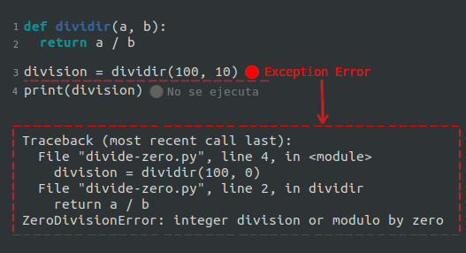
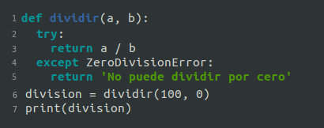
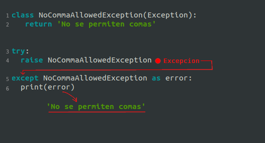

# Placa 1 - Introducción
Hoy en coopademia: Manejo de excepciones

# Placa 2 - Qué son las excepciones?

Una excepción es un evento inesperado que ocurre mientras ejecutamos nuestro programa, es decir, se interrumpe el flujo normal del mismo.

# Placa 3 - Qué tipo de eventos generan una excepción?

Existen muchísimos tipos de eventos que lanzan excepciones, y cada lenguaje implementa sus propias excepciones.
Además, no todos los lenguajes lanzan excepciones en los mismos escenarios.

Ejemplos:

- Intentar dividir por cero (en Python se lanza excepción, en Javascript no hay excepción, obtenemos el valor Infinito)
- Intentar hacer un request a una web que no existe (o está caída)(ConnectionError en Python con library requests)
- Intentar abrir un archivo que no existe (FileNotFoundError en Python)
- intentar acceder a una key de un diccionario que no existe (KeyError en Python)
- Intentar acceder a una propiedad de objeto inexistente: `objetoNull.propiedad` (TypeError en Javascript)

# Placa 4 - Qué pasa si no manejamos nuestras excepciones?

Supongamos que nuestro programa es una calculadora.

Vamos a necesitar definir qué hacer en algunos casos en donde el usuario pueda introducir datos que lleven a algún tipo de error, en este caso matemático.

Por ejemplo, si nuestro programa recibe dos números y una operación, y el usuario ingresa 1/0 en muchos lenguajes el programa lanzará una excepción.

¿Qué significa esto?

El flujo del programa se interrumpirá, y salvo que hagamos algo al respecto (“manejarlo”) el error se propagará hacia arriba en la llamada de funciones  hasta el final, lo cual causará que se detenga el programa.

En muchos lenguajes también obtendremos el mensaje de error en la consola y el lugar adónde se generó esa excepción.
 Por ejemplo en python vemos la información del  “ZeroDivisionError” que se lanzó

# Placa 5 - Manejo de excepciones
Lo que debemos hacer es adelantarnos a esta situación. Cómo? Manejando esa excepción.

Esto consiste en utilizar una estructura que posee (en principio) dos partes
- ## Try:
    Aquí va el código que suponemos que puede generar una excepción.
    Por ejemplo, código que realiza una división
- ## Catch (o except en Python):
    Este bloque se ejecuta sólo si dentro del try alguna parte del código lanza alguna excepción. Aquí vamos a "capturarla" y   actuar en función de ese error. Por ejemplo podemos:
    - mostrarle al usuario un mensaje de error
    - loggear el error y enviarlo a algún servicio externo que registre los errores de nuestra aplicación para luego poder corregirlo.
    - devolver un valor por defecto

# Placa 6 - Excepciones propias:
Todas las excepciones que mostramos hasta ahora vienen "de fábrica"(built-in) desde el lenguaje o alguna library.
Algunos lenguajes nos permiten crear nuestras propias excepciones para utilizar en caso de que las built-in no nos alcancen
Por ejemplo, tenemos un programa que le permite al usuario ingresar texto, pero no queremos que ingrese ninguna coma.

En Python para crear una excepción tenemos que heredar de la clase Exception.

En este ejemplo, adentro del try estamos simulando que hay código que chequea si el string ingresado tiene comas y en caso
de tener hace un **raise** de nuestra excepción

Utilizando `raise` en nuestro código podemos generar el lanzamiento de una excepción para los casos que así lo requieren.

# Links
