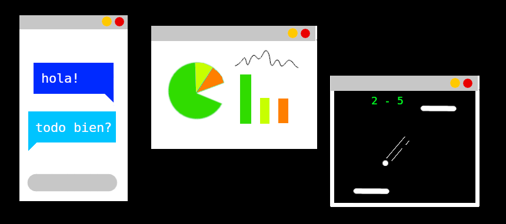

# Placa 1 - Introducción
Hoy en coopademia: Comunicación en tiempo real con websockets

# Placa 2 - Qué son los websockets?


WebSocket es un protocolo que proporciona un canal de comunicación bidireccional sobre una única conexión TCP.

Abre una sesión de comunicación interactiva entre el navegador del usuario y un servidor.

Más que nada está diseñada para utilizarlo en navegadores y servidores web.


# Placa 3 - Para qué usamos los websockets?

Los websockets pueden utilizarse para realizar comunicación de datos en tiempo real. Es decir, podemos recibir datos en nuestra página o aplicación, sin necesidad de hacer "refresh".

Esto suele implementarse en chats, juegos multijugador, gráficos y más.



# Placa 4 - Cómo funciona?


Los websockets funcionan con un servidor que está constantemente escuchando en un puerto determinado.

Cuando un dispositivo se conecta al websocket de ese servidor, puede recibir y enviar mensajes a través de el.

El servidor recibe el mensaje de cada dispositivo, y puede reenviarlo a todos los demás.
# Placa 5 - Websockets del lado del cliente:

Para conectarse a un servidor mediante websockets desde un navegador con JavaScript:

```
const conexion = new WebSocket('ws://192.168.0.1:3000')
```

Una vez que tenemos la conexión creada podemos enviar mensajes con la función `.send()`

```
conexion.send("Este es un mensaje");
```

Y para recibir los mensajes del servidor, debemos agregar un "listener", para que a la hora que llegue
un mensaje, podamos hacer algo con el:

```
socket.addEventListener('message', function ({data}) {

    alert(`NUEVO MENSAJE: ${ data }`);

});
```

# Placa 6 - Websockets del lado del Servidor

En un servidor Node.JS, podemos utilizar el módulo websocket, en conjunto con un servidor http como express (necesario para un "handshake" inicial):

```
const puerto = 3000
const httpServer = express()
const websocketServer = new WebSocketServer({ httpServer });

httpServer.listen( puerto );

```

Luego, para recibir los mensajes que recibimos de los dispositivos, podemos agregarle eventos al servidor de websocket:

```
websocketServer.on("connection", conexion =>{

        conexion.on("message", (message) => {

            conexion.send(message);

        });
    });
```

Cuando llega una conexión, podemos interactuar con ella, y si se trata de un mensaje, podemos reenviar con `conexion.send()`, este mismo mensaje a todos los dispositivos.

# Links

https://developer.mozilla.org/en-US/docs/Web/API/WebSocket
