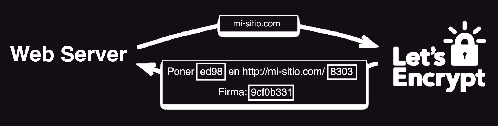

# Placa 1 - Introducción
Hoy en coopademia: HTTPS con 


# Placa 2 - Qué es HTTPS?

HTTPS (HyperText Transfer Protocol Secure, protocolo seguro de transferencia de hipertexto) es un protocolo de comunicación de Internet que protege la integridad y la confidencialidad de los datos de los usuarios entre sus ordenadores y el sitio.


# Placa 3 - Qué proporciona el protocolo HTTPS?

El envío de datos mediante el protocolo HTTPS está protegido con el protocolo Seguridad en la capa de transporte (Transport Layer Security, TLS), que proporciona estas tres capas de seguridad principales:

Cifrado: se cifran los datos intercambiados para mantenerlos a salvo de miradas indiscretas. Es decir, cuando un usuario está navegando por un sitio web, nadie puede "escuchar" sus conversaciones, hacer un seguimiento de sus actividades por las diferentes páginas ni robarle información.

Integridad de los datos: los datos no pueden modificarse ni dañarse durante las transferencias.

Autenticación (Demuestra que tus usuarios se comunican con el sitio web previsto).

# Placa 4 - Qué es Let's Encrypt?

Let’s Encrypt es una Autoridad de Certificación que brinda gratuitamente los certificados digitales necesarios para poder habilitar HTTPS en sitios web de la forma más amigable al usuario posible.


# Placa 4 - Cómo funciona Let's Encrypt?

Let’s Encrypt indentifica al administrador del servidor por llave pública. La primera vez que el software del agente interactúa con Let’s Encrypt, genera un nuevo par de llaves y demuestra al Let’s Encrypt CA que el servidor controla este dominio.



Una vez hecho esto, la autoridad de certificación verifica que los retos hayan sido satisfechos, y en la conexión verifica la firma. Si los retos son validos, entonces se le da autorización.


# Placa 5 - Certbot 

Certbot es una herramienta gratuita y de codigo abierto, para usar automáticamente los certificados de Let's Encrypt y habilitar HTTPS en sitios administrados manualmente.

El proceso de certificación de Certbot consiste en la validación (challenge) contra la CA (Autoridad de Certificación) de Let’s Encrypt para verificar que somos los propietarios del dominio del que se va a generar un certificado SSL.

Para poder utilizarlo necesitaremos tener acceso a la línea de comandos del servidor donde se aloja nuestro sitio mediante SSH, y tener instalado Certbot (Pueden ver su instalación en https://certbot.eff.org/).

# Placa 6 - Generando un certificado con Certbot manualmente

Para generar un certificado de forma manual, en la línea de comandos de nuestro servidor tenemos que ejecutar  `certbot certonly` , con los parametros  `-d mi-sitio.com`  y  `--manual` .

```
[root@mi-sitio.com ~]# certbot certonly -d mi-sitio.com --manual
```

Por seguridad, tendremos que aceptar que la IP de donde generamos el certificado sea registrada. Por lo que pondremos  `y`  al preguntarlo:

```
Are you OK with your IP being logged?
-------------------------------------------------------------------------------
(Y)es/(N)o: y
```


# Placa 7 - Generando un certificado con Certbot manualmente

Luego de esto, certbot nos dará un archivo que tenemos que generar en nuestro servidor, con su contenido:

```
Make sure your web server displays the following content at
http://mi-sitio.com/.well-known/acme-challenge/aSdFgK14RwdCfgTOc before continuing:

aFGdrokDVgoksdf235VSDFG324Gsdfhhfgh56DGjfsdlkfjgdfgaFGdrokDVgoksdf235VSDFG324Gsdfhhfgh56DGjfsdlkfjgdfg
...

-------------------------------------------------------------------------------
Press Enter to Continue

```

Por lo que tenemos que, en otra línea de comandos dentro del directorio de nuestro sitio,
crear la ruta  `.well-known/acme-challenge/`  y dentro de ella un archivo llamado  `aSdFgK14RwdCfgTOc` , el cual debemos ponerle el contenido que nos indica certbot ( `aFGdrokDVgoksd...` ).

Una vez hecho esto, en la consola de Certbot damos Enter, y listo!
Ya tenemos nuestro certificado generado, y podemos acceder a nuestro sitio mediante HTTPS.

# Links

https://letsencrypt.org/

https://certbot.eff.org/
