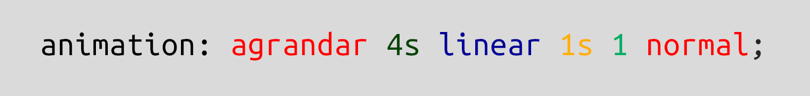

# Placa 1 - Introducción
Hoy en coopademia: Animaciones con CSS

# Placa 2 - Qué son las animaciones en CSS?

La animacion en CSS es una propiedad que permite cambiar gradualmente transición entre un estilo y otro. Da la posibilidad de cambiar tantos estilos, como la cantidad de veces que querramos.


# Placa 3 - Cómo funcionan las animaciones?

Las animaciones consisten en una serie de estilos definidas dentro de la regla  `@keyframes`, y distintas propiedades de animaciones para controlar su comportamiento. Una vez que tenemos definida las  `@keyframes`, es necesario aplicarlo en el elemento que queremos que se anime, utilizando la propiedad `animation-name` en el elemento.

```
@keyframes mi-primer-animacion {
    ...
}

div {
    animation-name: mi-primer-animacion;
}
```


# Placa 4 - Definiendo las @keyframes

Para definir los estilos dentro de `@keyframes` hay dos maneras:

- Si nuestra animacion es de una sola transición, podemos definir el estado inicial de la animación y el final con `from` y `to`:

```
@keyframes agrandar {
    from {width: 100px;}
    to {width: 200px}
}
```


- Si nuestra animación posee más de una transición, es posible definir diferentes estados con porcentajes:

```
@keyframes achicar-y-agrandar {
    0% {width: 100px;}
    50% {width: 50px;}
    100% {width: 150px;}
}
```


# Placa 5 - Propiedades de animación

Existen diferentes propiedades para controlar el comportamiento de las animaciones, ya sea su duración, tiempo en comenzar la animación, veces que se repite, dirección (si queremos que vaya en reversa), entre otras:

- `animation-duration`: asigna una duración a la animación de principio a fin. Su valor es en segundos. <br>
Por ejemplo: **animation-duration: 5s;**.


- `animation-delay`: asigna una demora de tiempo en segundos para que comience la animación. <br>
Por ejemplo: **animation-delay: 2s;**.

- `animation-iteration-count`: asigna la cantidad de veces que se repetirá la animación. Puede ser un numero o **infinite** para que nunca deje de animarse.


- `animation-direction`: especifica la dirección en la que la animación se reproducirá. Puede ser **normal**, **reverse**, **alternate** (primero normal, y después reversa) o **alternate-reverse** (primero en reversa y después normal).


- `animation-timing-function`: marca la velocidad de la animación. Puede tener los siguientes valores:
    - **ease**: comienza lentamente, luego rápido y finaliza lento.
    - **linear**: mantiene siempre la misma velocidad.
    - **ease-in**: aplica un comienzo lento.
    - **ease-out**: aplica un final lento.
    - **ease-in-out**: comienza y finaliza lentamente la animación.
    - **cubic-bezier(n,n,n,n)**: permite definir la velocidad basandose en una función de curvas de bezier.
<br><br>

- `animation-fill-mode`: especifica los estilos que debe tener el elemento antes de animarse o al finalizar. Este puede mantener los estilos del inicio de la animación (**backwards**), el de su finalización (**forward**) o ninguno (**none**).


# Placa 6 - La propiedad animation

Es posible simplificar todos los parametros de animación en una sola propiedad `animation`, la cual nos permite definir todo en una sola línea.

Esta esta compuesta de la siguiente manera:


De esta forma, podemos simplificar en una línea todas las propiedades que queremos asignarle a nuestra animación:




# Links

https://www.w3schools.com/css/css3_animations.asp

https://developer.mozilla.org/es/docs/Web/CSS/CSS_Animations/Using_CSS_animations
