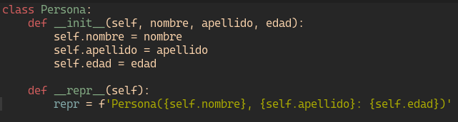
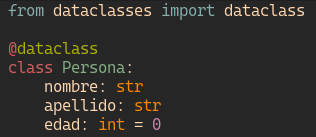
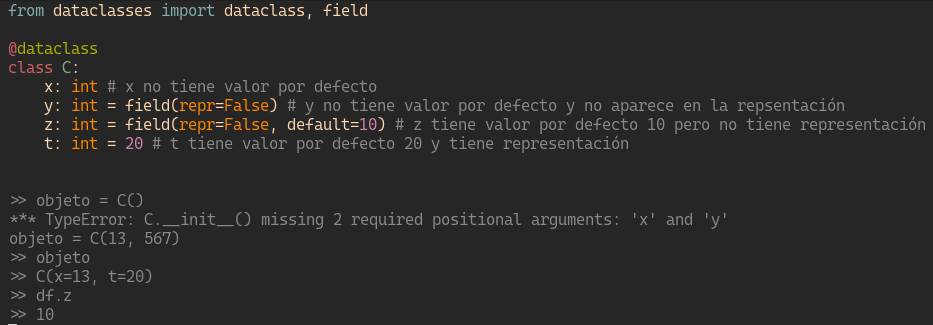

# Placa 1 - Introducción
Hoy en coopademia: Dataclasses de Python

Desde su versión 3.7 python nos provee de Dataclasses. Las mismas nos permiten generar muchos de los métodos y atributos de una clase que son normalmente utilizados de manera automatizada. (boilerplate).

# Placa 2 - ¿Qué son?

Las dataclasses en python nos permiten generar automáticamente los dunder methods también llamados métodos mágicos 

Incialización: __init__
Representación: __repr__
Comparación: __eq__, __lt__,__gt__, __le__, __ge__

Además de los métodos, facilita la creación de atributos e incialización de los mismos.

# Placa 3 - Clase tradicional



```
class Persona:
    def __init__(self, nombre, apellido, edad):
        self.nombre = nombre
        self.apellido = apellido
        self.edad = edad

    def __repr__(self):
        repr = f'Persona({self.nombre}, {self.apellido}: {self.edad})'
```     

# Placa 4 - Dataclass


```
from dataclasses import dataclass

@dataclass
class Persona:
    nombre: str     
    apellido: str    
    edad: int = 0

```     

# Placa 5 - Parámetros de incialización y valores por defecto

Para la mayoría de los casos podemos utilizar la incialización simple, para casos más complejos, deberemos utilizar el objeto field.


```
from dataclasses import dataclass, field

@dataclass
class C:
    x: int # x no tiene valor por defecto
    y: int = field(repr=False) # y no tiene valor por defecto y no aparece en la repsentación
    z: int = field(repr=False, default=10) # z tiene valor por defecto 10 pero no tiene representación
    t: int = 20 # t tiene valor por defecto 20 y tiene representación

>> objeto = C()
*** TypeError: C.__init__() missing 2 required positional arguments: 'x' and 'y'
objeto = C(13, 567)
>> objeto
>> C(x=13, t=20)
>> df.z
>> 10
    
```

# Placa 6 - Conclusión

Las dataclasses son una herramienta muy útil de python, que pueden ahorrarnos mucho tiempo escribiendo código y por lo tanto tener menos errores. No te olvidés de incorporarla a tu caja de herramientas

¡Hasta la próxima con más tips de python!

# Links

- https://docs.python.org/3/library/dataclasses.html
- https://realpython.com/python-data-classes/

