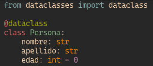
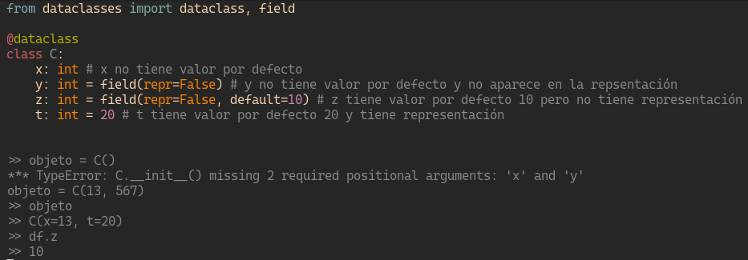

# Placa 1 - Introducción
Hoy en coopademia: Tipos de testing

A la hora de desarrollar software, en muchas ocasiones es poco valorado el proceso de prueba del mismo o "testing", siendo este cada vez mas importante a medida que nuestro proyecto crece. Hoy vamos a explorar los diferentes tipos de tests automatizados y para que sirve cada uno.

# Placa 2 - ¿Qué tipo de testing existen?

Si bien existen variedad de tipos de tests, a grandes rasgos podemos identificar las siguientes:

- Unit Tests
- Integration Tests
- Functional Tests
- End-To-End Tests
- Regression Testing
- Smoke Testing
- Acceptance Testing

# Placa 3 - Unit Tests

Son los tests de más bajo nivel. Mediante los tests de unidad lo que se prueba es funcionalidad lo más atómica y específica posible. Buscamos aislar el comportamiento de una función o método abstrayendo cualquuier interacción con otros módulos, funciones o agentes externos como bases de datos o conexiones de red.

# Placa 4 - Integration Tests



<!--
```
from dataclasses import dataclass

@dataclass
class Persona:
    nombre: str     
    apellido: str    
    edad: int = 0

```     
-->

# Placa 5 - Parámetros de incialización y valores por defecto

Para la mayoría de los casos podemos utilizar la incialización simple, para casos más complejos, deberemos utilizar el objeto field.



<!--
```
from dataclasses import dataclass, field

@dataclass
class C:
    x: int # x no tiene valor por defecto
    y: int = field(repr=False) # y no tiene valor por defecto y no aparece en la repsentación
    z: int = field(repr=False, default=10) # z tiene valor por defecto 10 pero no tiene representación
    t: int = 20 # t tiene valor por defecto 20 y tiene representación

>> objeto = C()
*** TypeError: C.__init__() missing 2 required positional arguments: 'x' and 'y'
objeto = C(13, 567)
>> objeto
>> C(x=13, t=20)
>> df.z
>> 10
    
```
-->

# Placa 6 - Conclusión

Las dataclasses son una herramienta muy útil de python, que pueden ahorrarnos mucho tiempo escribiendo código y por lo tanto tener menos errores. No te olvidés de incorporarla a tu caja de herramientas

¡Hasta la próxima con más tips de python!

# Links

- https://docs.python.org/3/library/dataclasses.html
- https://realpython.com/python-data-classes/

